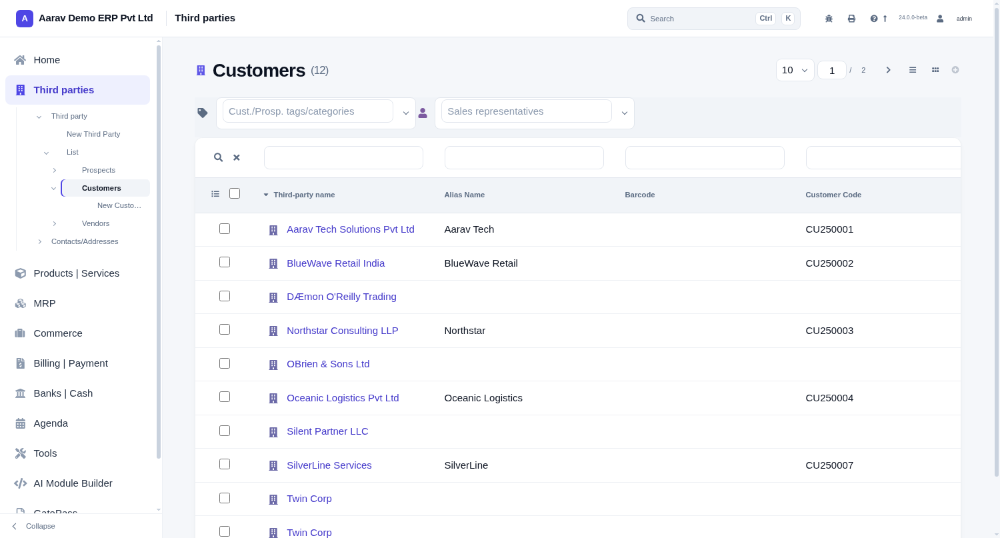

# Thrive themes for Dolibarr

Five complete themes for **Dolibarr ERP/CRM**, built from scratch rather than
recoloured from `eldy`. Each ships its own application shell — its own
`MenuManager`, its own navigation DOM — on a shared, token-driven component layer.

| Theme | Shell | Character |
|---|---|---|
| **command** | fixed top bar + collapsible sidebar, `Ctrl/⌘ K` palette | light, calm, keyboard-first |
| **workbench** | 68px icon rail + section panel | dark rail, teal accent, dense |
| **aurora** | top bar + side groups | dark, violet accent |
| **editorial** | wide left column | light, generous type |
| **dense** | compact bar + tab strip | maximum rows per screen |



## Why these are not palette swaps

Dolibarr picks a **`MenuManager`** class server-side. A theme that ships only CSS is
restyling markup it does not control, which is why most themes end up as the same
interface in a different shade.

Each theme here emits its own shell. That is what makes a 68px icon rail or a command
palette possible at all — and it is why `?theme=x` only previews a **stylesheet**: the
shell comes from the saved theme, because the manager already ran server-side.

## Supported Dolibarr versions

Verified on **22.0.4** and **24.0.0-beta**.

Both expose the same theme surface — `showmenu($mode, $moredata)`,
`print_left_eldy_menu(...)` and the same 66 theme variables — so one codebase covers
both. The full audit runs clean on 22.0.4 for all five themes.

## Install

```bash
cp -r htdocs/theme/<theme>       /path/to/dolibarr/htdocs/theme/
cp -r htdocs/core/thriveshell    /path/to/dolibarr/htdocs/core/
cp    htdocs/core/menus/standard/*.php /path/to/dolibarr/htdocs/core/menus/standard/
```

Select the theme in **Home → Setup → Display**, then register its menu manager:

```sql
-- command
UPDATE llx_const SET value='command_menu.php'     WHERE name='MAIN_MENU_STANDARD';
-- workbench, aurora, editorial, dense
UPDATE llx_const SET value='thriveshell_menu.php' WHERE name='MAIN_MENU_STANDARD';
```

Without that second step the stylesheet applies but the shell does not.

## Architecture

```
theme/<name>/            palette, shell CSS, theme variables
core/thriveshell/        shared components — theme-agnostic, reads --c-* tokens
core/menus/standard/     the MenuManager classes that emit each shell
```

`thriveshell/` never hardcodes a colour. A new theme supplies a palette and inherits
the whole component set: tables, cards, forms, dialogs, tree views, agenda grid,
select2, editor chrome, dark mode.

## Accessibility

WCAG 2.1 AA text contrast, verified across 169 pages × 3 viewports per theme, measured
with alpha compositing (a `color-mix()` tint resolves to `color(srgb r g b / a)` — a
checker that drops the alpha scores a 15% tint as an opaque fill).

Visible focus is a border **and** a ring on every control. No horizontal scroll and no
content behind fixed chrome at any tested width.

## Documentation

- [Architecture](docs/architecture.md)
- [Design tokens](docs/design-tokens.md)
- [Verification](docs/verification.md) — the harness, and the checker bugs it caught
- [Compatibility](docs/compatibility.md) — how 22.0.4 support was established

## Licence

GPL-3.0-or-later, matching Dolibarr.
